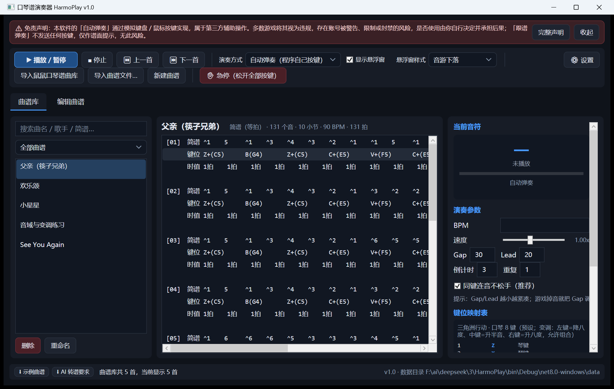
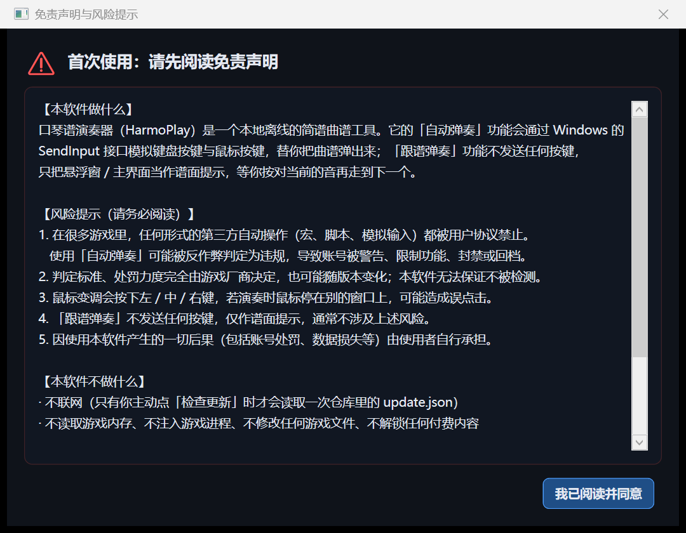
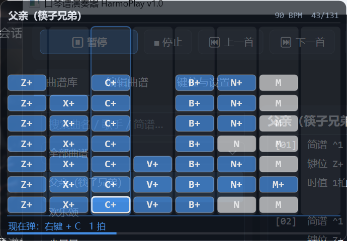
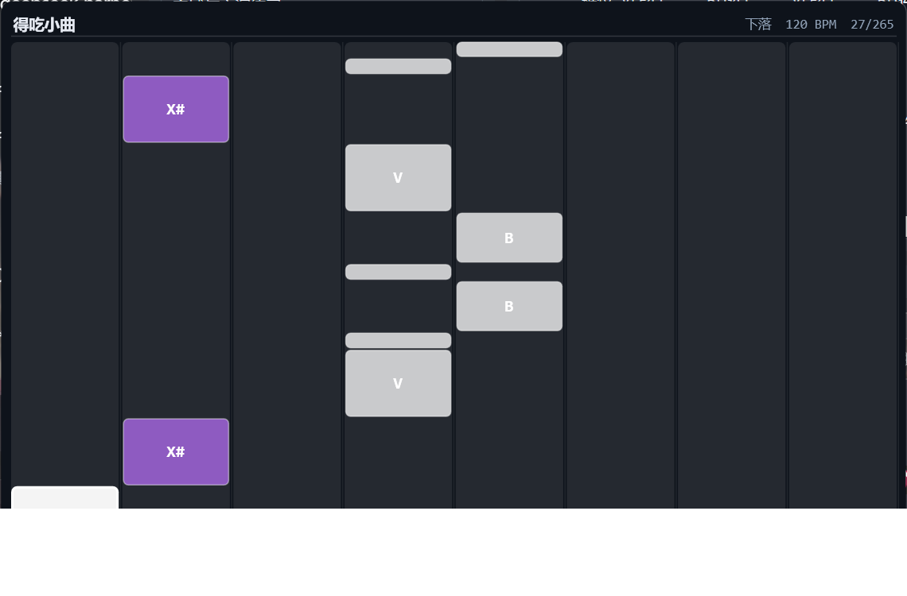
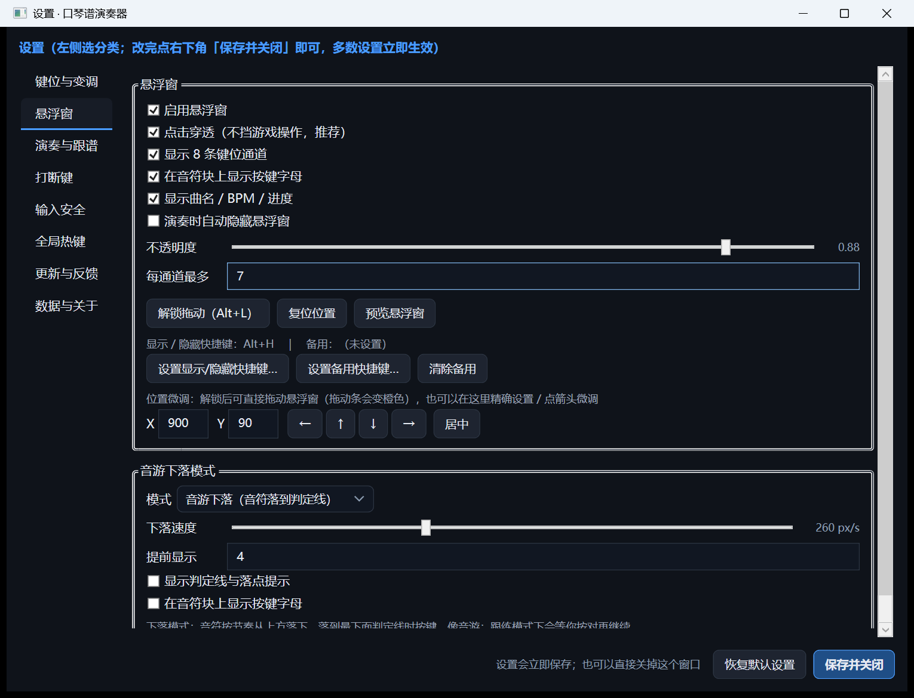

# 口琴谱演奏器 HarmoPlay

**本地离线**的简谱曲谱库 + 自动演奏 + 悬浮窗键位提示工具，内置《三角洲行动》口琴 8 键预设，
键位可自由映射；支持把 AI 转好的曲谱一键导入、校验、跟练和「音游下落」模式。

> 定位：**离线免费**的口琴谱演奏工具。不含账号 / 付费 / 在线曲谱 / 教练视频，**全程不联网**
> （只有你主动点「检查更新」时才会去读一次仓库里的 `update.json`）。







---

## ⚠ 免责声明（请先阅读）

- 本软件的**「自动弹奏」通过模拟键盘 / 鼠标按键（Windows `SendInput`）**实现，属于第三方辅助操作。
  多数游戏的用户协议禁止任何形式的自动操作，使用后**可能被判定违规，导致账号被警告、限制或封禁**。
  是否使用由你自行决定，**产生的一切后果由使用者自行承担**。
- 软件顶部常驻免责声明横幅（可收起 / 查看完整版）；**首次切换到「自动弹奏」会弹出风险提示**，
  点「不同意」则不会开启自动弹奏，程序会自动改用「跟谱弹奏」。
- 想要零风险：用**「跟谱弹奏」**——不发送任何按键，只把悬浮窗 / 主界面当谱面提示。
- 本软件**不联网**（只有你主动点「检查更新」时读一次 `update.json`）、不读游戏内存、不注入游戏进程、不修改游戏文件、不解锁任何付费内容。

## 功能一览

| 模块 | 说明 |
| --- | --- |
| 曲谱库 | 分类 + 搜索（曲名 / 歌手 / 简谱内容）；内置示例曲谱；可导入外部曲库的 `library.json` |
| 简谱解析 | 三种格式自动识别 → 三角洲可视化谱、固定音高谱（AI 转谱规范）、D-hydra 键位谱 |
| 简谱编辑器 | 边写边解析，每小节显示「简谱 / 键位 / 时值 / 音名」；导入导出 TXT、JSON |
| 演奏引擎 | SendInput 扫描码注入键盘 + 鼠标修饰键；BPM / 速度 / Gap / Lead / 重复 / 同键连音；开播 **3 秒倒计时** |
| **两种模式** | 最顶端切换：**演奏模式**（自动弹奏 / 跟谱弹奏）／**练习模式**（不发送任何按键，音游式实时判定：完美 ±80ms、良好 ±180ms、按错/超时=错过，带连击、准确率、按键实时亮起、练习速度 0.4~1.5x、可调「等你按对再前进」） |
| **演奏方式** | 三种，工具栏下拉或 `Alt+T` 循环：**自动弹奏**（程序按键，开启前弹风险确认）／**跟谱弹奏**（不发按键，等你按对再走，可设超时跳过）／**新手模式**（不发按键，**必须按对并按住整拍才继续、按错或没按住就停住、永不跳过**，切入时自动降到 0.8x），都带 ✔✖漏 统计 |
| 全局热键 | 播放暂停、停止、上下首、悬浮窗显隐与锁定、跟练切换、快捷曲 1~6（均可改键） |
| 悬浮窗 | 置顶、半透明、点击穿透；**音游下落（默认）** 与 **经典堆叠** 两种模式，`Alt+M` 切换；解锁后橙色边框 + 拖动提示，任意位置拖动、`Ctrl+滚轮` 缩放、右键菜单、X/Y 精确设置与 ←↑↓→ 微调、居中；下落模式带连击数与命中闪光 |
| 键位映射 | 预设（三角洲 8 键 / 数字键 / 字母键）+ 可视化自定义（逐个按键捕获、6 种变调、配色） |
| 跟练模式 | 不发送按键，等你按对当前音再继续，可当练琴谱面用 |
| **演奏打断键** | 玩家一按 WASD / 空格 / 1234 切枪 / Tab 背包，立即暂停演奏并松开所有按键；10 个键全部可自定义（改键、启停、增删），可设"松开后自动继续" |
| **输入安全** | 停止/暂停/急停/退出/崩溃都强制松开；250ms 看门狗兜底；启动时清理上次残留；急停热键 `Ctrl+Alt+0`；可选"绝不碰鼠标" |
| **关闭行为** | 点 ✕ 时询问「退出程序 / 最小化到后台」；退到后台则窗口收进**右下角托盘**（双击恢复、右键菜单可播放暂停/停止/退出），悬浮窗与全局热键继续工作，可勾「记住我的选择」 |
| **输入自检** | 一键判断"自动弹奏为什么没反应"：装钩子 + 注入测试键，检测程序完整性（Low 完整性沙箱会让 Windows 丢弃模拟输入）、输入桌面、前台窗口，并给出针对性建议 |
| **AI 转谱校验** | `--validate` 按转谱规范校验 JSON：语法、时值、音域、小节拍数、字段类型 |
| **更新接口** | 从仓库 `update.json` 检查新版本（只提示、不自动替换） |
| **问题反馈** | 一键打开 GitHub Issues；内置诊断包导出（含环境与日志，不含曲谱内容） |

## 下载与运行

1. 到 [Releases](../../releases/latest) 下载 `HarmoPlay-<版本>-win-x64.zip`；
2. 解压后双击 **`口琴谱演奏器.exe`**（自包含，无需安装 .NET）；
3. **保持 5 个原生 DLL 与 exe 在同一目录**（`D3DCompiler_47_cor3.dll`、`PenImc_cor3.dll`、
   `PresentationNative_cor3.dll`、`vcruntime140_cor3.dll`、`wpfgfx_cor3.dll`）。

> **首次运行会弹「Windows 已保护你的电脑 / 发布者未知」**：这是 SmartScreen 对未签名程序的通用提示
> （不是杀毒报警）。点「更多信息 → 仍要运行」，或右键 exe → 属性 → 勾「解除锁定」。
> 想彻底消除需要代码签名证书，发布流程已预留自动签名（见 [docs/代码签名.md](docs/代码签名.md)）；
> 包内附 [首次运行说明.txt](docs/首次运行说明.txt) 一并说明。

> **若解压时弹出「你的 Internet 安全设置阻止打开一个或多个文件」**：这是 Windows 给下载文件打的
> **下载标记（Mark of the Web）**造成的（与上面的 SmartScreen 提示不同）。右键压缩包 →「属性」→
> 勾「解除锁定(Unblock)」后再解压；或解压后双击包内的 **`解除下载锁定.cmd`**
> （等价于 `Get-ChildItem -Recurse | Unblock-File`）。

> 游戏以管理员身份运行时，本程序也要**右键 → 以管理员身份运行**，否则游戏收不到模拟按键。

## 三分钟上手

1. 左侧选一首曲谱 → `Alt+1` 播放 / 暂停。
2. 悬浮窗按 `Alt+L` 解锁后可拖动，`Ctrl+滚轮` 缩放；再按 `Alt+L` 锁定（点击穿透，不挡操作）。
3. 想让音符按节奏落下来：设置里把悬浮窗模式切到**音游下落**，或直接在「设置 → 悬浮窗 → 音游下落模式」里调速度与提前量。

### 默认键位（三角洲行动 · 口琴）

```
8 个琴键：  z   x   c   v   b   n   m   ,
简谱：      1   2   3   4   5   6   7   8（8 = 高音 1）
```

变调靠鼠标：**左键 = 降八度**、**中键 = 升半音**、**右键 = 升八度**。
中键与左键/右键的组合（黄 / 红两档）**技术上可用**，但**人手很难同时按出**，因此程序默认
**优先选择不需要组合的指法**（例如最高音 C6 用「逗号键 + 右键」），只有没有更简单指法时才用组合
（C#3/D#3/F#3/G#3/A#3 与 D#5/F#5/G#5/A#5 这 9 个音）。转谱建议把旋律放在中音区 C4~B4——
这一段黑键只要按住中键，不需要组合。详见 [曲谱生成与导入教程](docs/曲谱生成与导入教程.md#6-固定音高对照表c3c6midi-4884)。

### 全局热键

| 热键 | 作用 |
| --- | --- |
| `Alt+1` / `Alt+2` / `Alt+3` / `Alt+↑` | 播放暂停 / 停止 / 下一首 / 上一首 |
| `Alt+H` / `Alt+L` | 悬浮窗 显隐 / **锁定 ↔ 解锁切换**（解锁后可拖动、右键菜单、`Ctrl+滚轮` 缩放） |
| 备用显隐键（默认留空） | 「设置 → 悬浮窗」里点「设置备用快捷键…」自己指定；`Alt+H` 与游戏冲突时用它，也可随时清除 |
| `Alt+T` | 自动演奏 ↔ 跟练模式 |
| `Ctrl+Alt+0` | **急停**：停止演奏并强制松开所有按键与鼠标键 |
| `Alt+4` ~ `Alt+9` | 快捷曲 1~6（曲谱上右键绑定） |

### 演奏打断键（可自定义）

游戏里一移动、一切枪、一开背包，口琴就会中断。程序盯着这些键，**你一按就暂停演奏并松开所有按键**，
避免继续把按键灌进背包 / 菜单界面：

```
默认：W A S D · 空格 · 1 2 3 4 · Tab
打断后：暂停等我手动继续 ／ 松开后自动继续（延迟可调）
```

在「设置 → 打断键」里可以逐个**改键 / 勾选启停 / 删除 / 添加**，或一键恢复默认。
带 `Alt`/`Ctrl`/`Win` 的组合不参与打断（否则按钮自己的 `Alt+1` 会被误判成"切枪 1"），
与琴键重复的键也不参与并会给出黄字提醒。

### 输入安全（不会被"抢走"键盘鼠标）

注入型程序最怕"按下去没松开"，本项目做了四层防护：

1. 停止 / 暂停 / 急停 / 退出 / 崩溃 → 强制松开；
2. **250ms 看门狗**：只要没在演奏，就保证没有任何键或鼠标键处于按下状态；
3. 启动时先发一轮"全部松开"，修掉上次异常退出的残留；
4. 急停热键 `Ctrl+Alt+0` + 工具栏「✋ 急停」按钮。

还怕影响鼠标？勾选「不发送鼠标修饰键（只按白键）」就完全不碰鼠标（代价：升降调失效）。
实测审计：演奏中途停止后，注入的每个按键/鼠标键 DOWN 都有配对的 UP，**零残留**。

## 两种模式

主界面**最顶端**可以切换：

- **🎵 演奏模式**：程序自动弹奏（模拟按键）或跟谱提示；
- **🎯 练习模式**：**不发送任何按键**，只读取你的按键并实时判定（完美 / 良好 / 错过），
  右侧显示连击、准确率、判定大字，下方「你的按键」实时亮起，中间是音游式下落谱面，
  可调练习速度与「等你按对再前进」。也可以 口琴谱演奏器.exe --practice 直接进入。

## 设置在哪

主界面**右上角「⚙ 设置」**打开**二级设置菜单**（左侧分类）：
**键位与变调 / 悬浮窗 / 演奏与跟谱 / 打断键 / 输入安全 / 全局热键 / 更新与反馈 / 数据与关于**。
改完点「保存并关闭」，多数设置立即生效；也可用 `口琴谱演奏器.exe --settings [0~7]` 直接打开。`r`n`r`n关掉窗口时会问你「**退出程序**」还是「**最小化到后台（托盘）**」，后者会把图标留在屏幕右下角。

## 曲谱从哪来

- **内置示例**：首次启动自带小星星、欢乐颂、See You Again、父亲、音域与变调练习、**歌唱祖国**、**起风了（主歌+副歌）**；升级后会自动补齐缺失的内置曲谱（也可在「设置 → 数据与关于 → 重新导入内置曲谱」手动补齐）。
- **主界面左下角两个按钮**（任何页面都可见）：
  - **⬇ 示例曲谱** —— 另存为一份可直接导入的示例曲谱（小星星）+ 格式说明；
  - **⬇ AI 转谱要求** —— 另存为一份**可直接复制给 AI** 的完整转谱要求 txt
    （格式规范 / 音高对照 / 节奏换算 / 反复与声部 / 音域与鼠标组合键限制 / 自检清单）。
- **批量导入（推荐日常用）**：支持 **CSV / TSV 表格**（Excel、WPS 一行一首）、**JSON**（单个 / 数组 / `{"songs":[…]}`）、
  **简谱 txt**（每首一个文件或整个文件夹）——不再依赖任何软件的私有格式。
  - 工具栏「导入曲谱文件…」（多选 CSV/JSON/TXT）；「设置 → 数据与关于 → 批量导入文件夹…」；
  - **反向**：「设置 → 数据与关于 → 导出曲谱库为 CSV…」，Excel 编辑后再导回，完美往返；
  - 命令行：`口琴谱演奏器.exe --import "D:\曲谱文件夹"`、`--export-csv "D:\我的曲谱.csv"`；
  - CSV 列：`曲名,简谱,BPM,拍号,歌手,分类,记谱,启用`（只有前两列必填），模板见发布包 `文档与示例\批量导入模板.csv`。
- **兼容旧格式**：工具栏「导入外部曲库」仍可导入原版 `library.json`（已非必需）。
- **AI 转谱**（推荐）：把左下角那份 txt 全文给大模型，再附上音频 / MIDI / 五线谱 / 简谱图片。

👉 完整流程、提问模板、固定音高对照表、常见错误清单见
**[docs/曲谱生成与导入教程.md](docs/曲谱生成与导入教程.md)**，规范原文见
[docs/AI转谱要求-原文.txt](docs/AI转谱要求-原文.txt)。

```bat
:: 校验 AI 生成的曲谱（错误必须为 0 才导入）
HarmoPlay.exe --validate "D:\曲谱\晴天.json"

:: 批量导入一个目录里的 txt / json
HarmoPlay.exe --import "D:\曲谱"
```

## 命令行参数

```
HarmoPlay.exe                    启动图形界面
--selftest                       自检（解析器 / 键位表 / 校验器 / 更新接口 / 诊断包），结果写 selftest.log
--validate <曲名.json> ...       按转谱规范校验曲谱文件
--import <文件|目录>             导入曲谱（library.json / 单曲 JSON / 简谱 txt / 目录）
--checkupdate [地址]             检查更新，结果写 update-check.log
--feedback                       导出诊断包到 data/feedback/
--list                           列出曲谱库到 library.txt
--help                           显示帮助
```

## 数据目录

优先放在**程序同目录的 `data\`**（绿色便携）；该目录不可写时依次回退到
`%APPDATA%\HarmoPlay` → `%LOCALAPPDATA%\HarmoPlay` → 文档 → 临时目录。

```
data/library.json    曲谱库（分类 + 曲谱 + 简谱文本 + BPM）
data/settings.json   设置（键位映射、热键、悬浮窗、演奏参数、更新地址）
data/feedback/       导出的诊断包
```

## 更新与反馈

- **更新**：读仓库根目录的 [update.json](update.json) 比对版本，只提示、不自动替换。
  格式与自动发版流程见 **[docs/更新接口.md](docs/更新接口.md)**；
  推一个 `v*` 标签，GitHub Actions 会自动编译、打 zip、发 Release 并更新清单。
- **反馈**：软件内一键打开 GitHub Issues；先点「导出诊断包」，把
  `HarmoPlay-诊断-*.txt`（不含曲谱内容）一起贴进 Issue。
  见 **[docs/问题反馈.md](docs/问题反馈.md)**。

上传自己的仓库后，记得把更新地址改成自己的：软件「设置 → 更新与反馈」，
或直接改 `AppSettings` 里的 `UpdateUrl` / `DownloadUrl` / `IssuesUrl`。

## 从源码构建

需要 **.NET 8 SDK**（源码面向 Windows / WPF）。

```powershell
dotnet build   HarmoPlay.csproj -c Debug
dotnet publish HarmoPlay.csproj -c Release -r win-x64 --self-contained true `
    -p:PublishSingleFile=true -p:DebugType=none -o dist
```

> ⚠️ **不要加** `-p:IncludeNativeLibrariesForSelfExtract=true`：那要求运行时把原生库解压到
> `%TEMP%\.net`，在部分被 ACL 限制的用户目录下会直接启动失败
> （`Failed to create default extraction directory`）。
> 当前发布方式 = 托管程序集内嵌进单文件 exe + 5 个 WPF 原生 DLL 放同目录，无需解压。

本地打完整发布包（含 zip、SHA256、update.json）：

```powershell
pwsh -File tools/make-release.ps1 -Version 1.0.1 -Notes "新增下落模式" -Repo "你的用户名/HarmoPlay"
```

## 项目结构

```
HarmoPlay.csproj            工程（WPF / net8.0-windows / 自带 Program.Main）
Program.cs                  入口：启动追踪 + 命令行模式
App.xaml(.cs)               深色主题 + 全局异常记录
SelfTest.cs                 无界面自检
Cli.cs                      命令行（import / validate / checkupdate / feedback / list）
Models/                     Song、KeyMap（预设与自定义映射）、PitchFingering（固定音高与指法）、设置
Core/                       ScoreParser 简谱解析、ScoreValidator 转谱校验、Chord 组合解析、
                            InputSender SendInput、PlaybackEngine 演奏引擎、GlobalHotkeys 全局热键、
                            LibraryStore 存储与导入导出、UpdateService 更新接口、Diagnostics 诊断包
Views/                      MainWindow 主界面、OverlayWindow/OverlayCanvas 悬浮窗（堆叠 + 下落）、
                            KeyMapWindow 键位编辑、HotkeyCaptureWindow、InputWindow
Assets/Seed/*.txt           内置示例曲谱
docs/                       曲谱生成与导入教程、转谱规范原文、更新接口、问题反馈、截图
tools/make-release.ps1      本地打发布包
.github/workflows/release.yml  推 v* 标签自动发版
```

## 免责声明

- 本程序只做三件事：画置顶窗口、读键盘鼠标状态、（自动演奏时）模拟按键。
  **不联网、不读游戏内存、不注入游戏进程、不修改任何游戏文件。**
- 请遵守你所玩游戏的用户协议，自行评估使用风险。
- 曲谱版权归原作者所有；请不要传播未授权的付费曲谱。

## 许可

[MIT](LICENSE)


